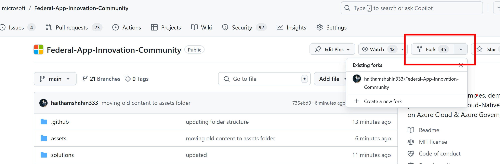
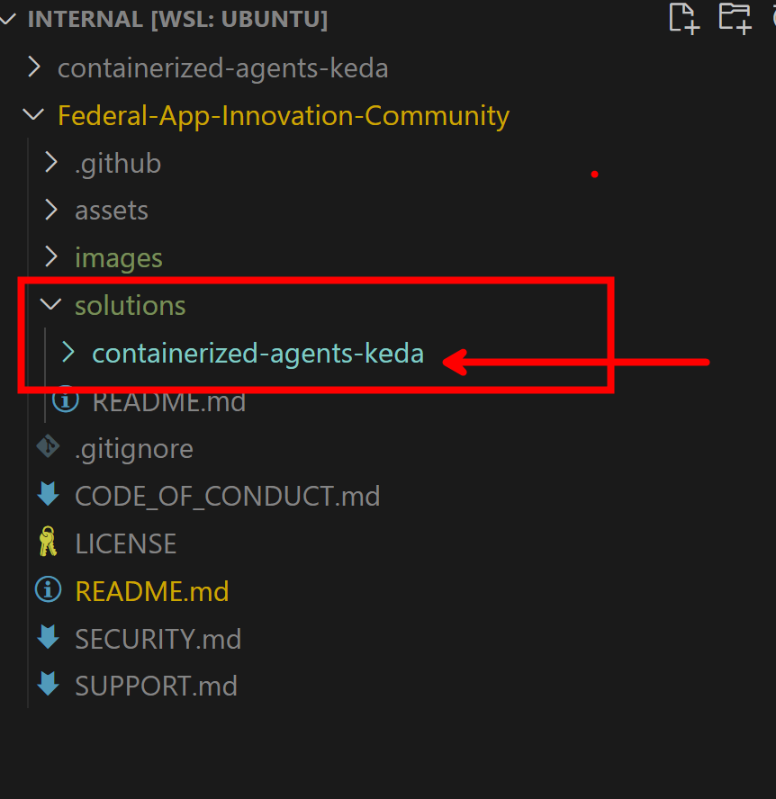
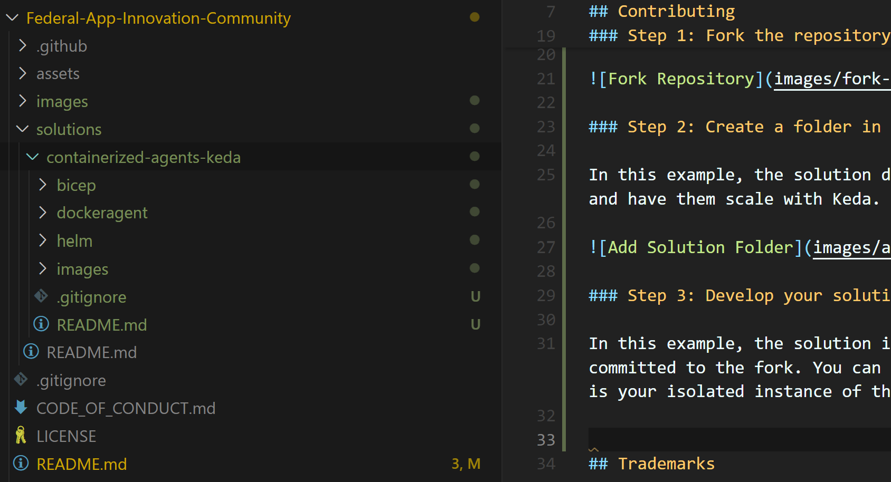
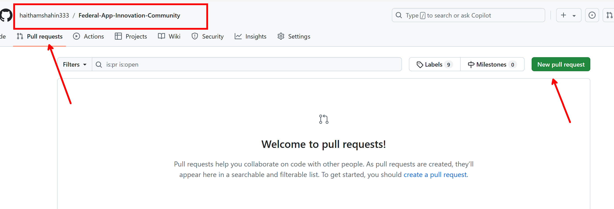
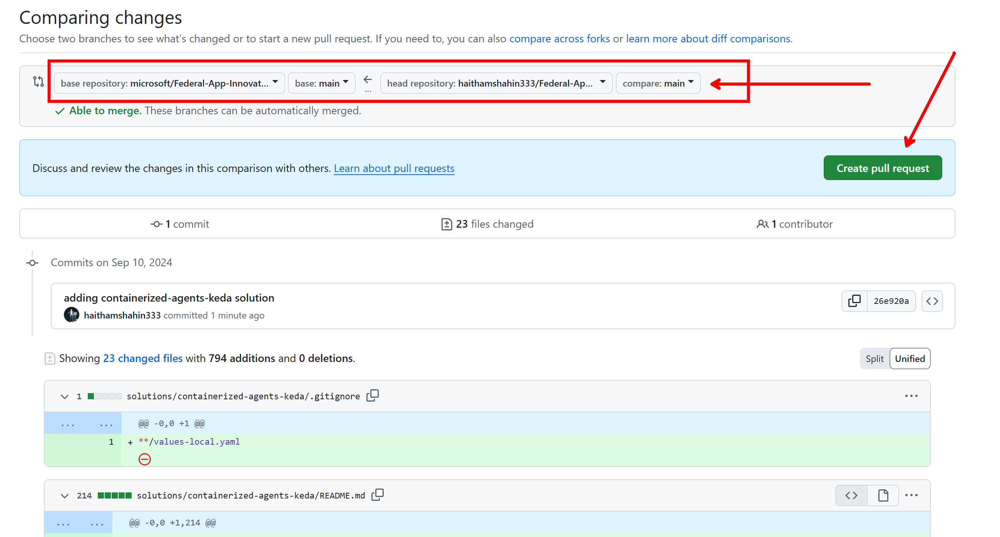
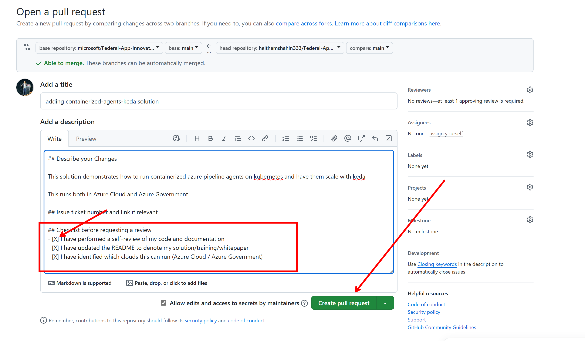
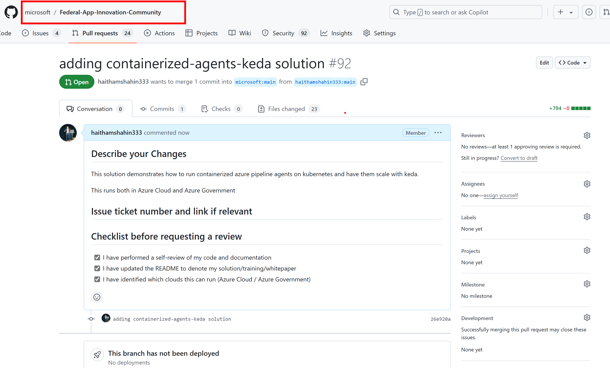
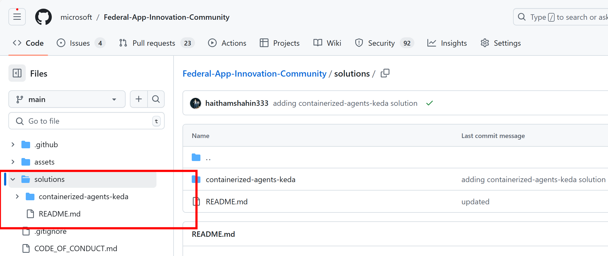

# Federal Application Innovation Community Repository

This repository consists of patterns, solutions, and demos for federal customers and partners. This guidance is built by an active open-source community with an authentic federal perspective. Teams can use this repository as a starting point to successfully implement cloud-native architectures and services in Azure Cloud & Azure Government Cloud.

We recommend using these solutions to accelerate your own outcomes, you can fork the repo as well to customize the solution as needed.

# Contributing

You can contribute new solutions to the `/solutions` folder in the repo.  
You can contribute new templates (bicep, terraform, etc) to the `/templates/` folder in the repo. 

A few guidelines as you design your solution:

1. Document the solution and explain what is provides and how it is architected - this can be a video, README, document, etc.

2. Provide deployment instructions

3. Try to make the solution 'generic' meaning others can provide parameters/inputs for customization for their own environments and scenarios. If you need assistance with parameterizing your work, please create a pull request and specify you need assistance with it.

## Step 1: Fork the repository to have your own instance of the repo

## Step 2: Create a folder in the `solutions` folder that represents your solution

In this example, the solution demonstrates how to deploy azure devops agents to kubernetes and have them scale with Keda.

## Step 3: Develop your solution and commit back to your fork

In this example, the solution is built and commit history as the solution is developed is committed to the fork. You can use whatever branching strategy on your fork since the fork is your isolated instance of the repo.

## Step 4: Create a Pull Request when the solution is ready to be merged

Once the solution is ready to be merged into the upstream repo, make a pull request on your fork for others to review.

**Create the Pull Request on your Fork**

**Select the Fork Branch you want to Merge**

As you create the PR, be sure that the branch on your fork is correct. In this example, the solution was committed on the main branch of the fork which is what you see as the branch next to the head repository.

> A good check is review the files that are being changed. You should see they are all encapsulated under your solution folder.

**Fill Out the PR Description and Checklist**

**Create the PR and Await Review on Main**

## Step 5: Review comments/questions from reviews on the PR

As the PR is reviewed, try to address any questions/comments.

## Step 6: PR merged to main repo

Once you have an approving review, you should see the repo committed!

# Trademarks

This project may contain trademarks or logos for projects, products, or services. Authorized use of Microsoft 
trademarks or logos is subject to and must follow 
[Microsoft's Trademark & Brand Guidelines](https://www.microsoft.com/en-us/legal/intellectualproperty/trademarks/usage/general).
Use of Microsoft trademarks or logos in modified versions of this project must not cause confusion or imply Microsoft sponsorship.
Any use of third-party trademarks or logos are subject to those third-party's policies.
