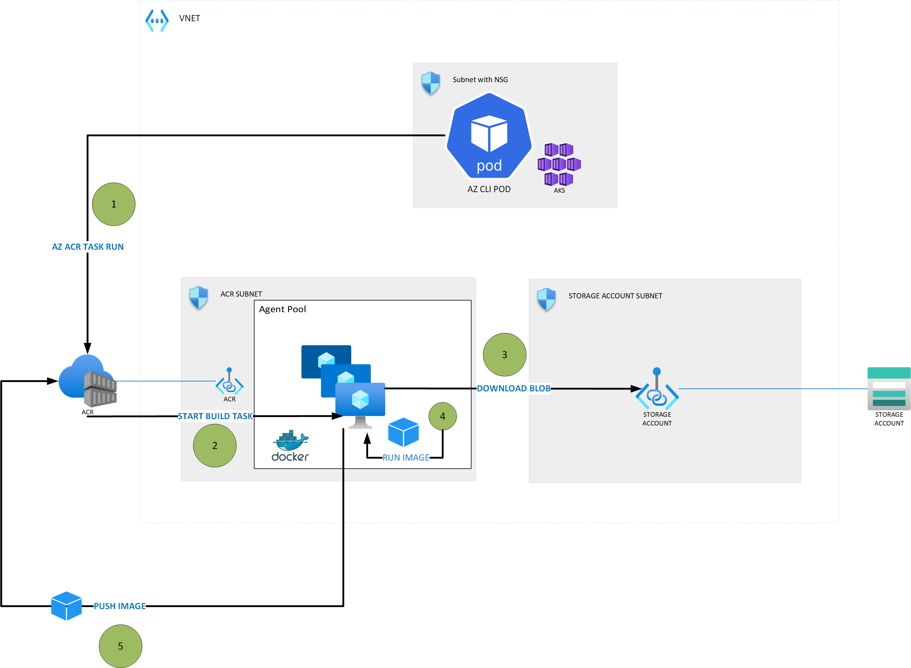

# Private ACR Tasks

## Problem Statement & Background
As of AKS Version 1.19+, containerd is the container runtime for linux node pools (details references [on the docs](https://docs.microsoft.com/en-us/azure/aks/cluster-configuration#container-runtime-configuration)). Therefore, prior workflows of using Docker to build images within your AKS cluster will no longer support connecting to a local Docker daemon on the node or using Docker-in-Docker.

A potential solution to support your image builds as part of a CI process where agents are run on your cluster is to leverage [ACR Build Tasks](https://docs.microsoft.com/en-us/azure/container-registry/container-registry-tasks-overview). ACR will spawn a task that will run your Dockerfile to build your image. However, another potential challenge arises which is what if my Dockerfile consumes internal/private artifacts? For example, maybe base images are stored in an internal registry that is not ACR, or maybe you want to pull artifacts from a private Storage Account or Version Control.

That's where we can leverage [Dedicated Agent Pools](https://docs.microsoft.com/en-us/azure/container-registry/tasks-agent-pools) with the ACR Tasks. Agent Pools can be deployed within a VNET so that you can access internal/private dependencies for your image builds and run your tasks in a private manner.

## Demo Solution with ACR Tasks and Dedicated Agent Pools



## Requirements for Deployment
1. Premium ACR Registry
2. [Outbound Firewall Rules](https://docs.microsoft.com/en-us/azure/container-registry/tasks-agent-pools#add-firewall-rules) for VNET-Injected Agent Pools
3. [Preview Limitations] of Agent Pools

> Reference: Review the following [doc](https://docs.microsoft.com/en-us/azure/container-registry/tasks-agent-pools) for additional updates/details.

## Deployment Steps

1. ### Deploy the Architecture

    In this step, we will deploy the infrastructure required for the scenario using Bicep. You can run the commands below from your local shell or Cloud Shell assuming you've cloned the repo to your environment.

    > Important: You will pass your SSH Public Key for the AKS Cluster that is created as a parameter when the bicep deployment is initiated below.

    ```bash
    az cloud set --name <AzureCloud | AzureUSGovernment>

    az login --use-device-code

    export LOCATION=<eastus | usgovvirginia | etc.>

    az deployment sub create \
        --name acr-demo-deployment \
        --template-file bicep/main.bicep \
        --location $LOCATION
    ```

2. ### Deploy AZ CLI Pod to AKS

    In this step, we are now going to run a pod on the AKS Cluster that is mocking the scenario of a pipeline agent running on AKS. A pipeline agent (i.e. a DevOps agent, GitHub runner, etc.) would likely run with service principal permissions to downstream resources that it requires. In this scenario, we will login as your identity and run az cli commands to simulate that scenario.

    > Important: If you modified the parameters for names of resources as part of the Bicep deployment, you will need to update the commands below to reflect that. For example, if you changed the AKS Cluster name, you should update the name parameter in commands below to connect to your AKS cluster.

    ```bash
    az aks get-credentials -n aks-cluster -g acr-demo

    kubectl apply -f assets/az-cli-pod.yaml

    kubectl exec -it pod/azcli -- /bin/sh
    ```

    > Reference: After you `exec` into the container, you should see in the root directory the `test.txt` file. You can run `cat test.txt` to view the test contents. This is the file our image later on will require as part of its build process and pull from our storage account.

3. ### Seed Storage Account with Test File

    The next set of commands will be run from within the container's shell. Notice the values you will need to replace to upload the blob to your private storage account. You should find those in the portal

    > Important: You should already be in the pod - run the `kubectl exec -it pod/azcli -- /bin/sh` command as noted in prior step before running commands below.

    ```bash
    az cloud set --name <AzureCloud | AzureUSGovernment>
    az login --use-device-code

    STORAGE_ACCOUNT_NAME=<Provide Storage Account Name>

    KEY=$(az storage account keys list --account-name $STORAGE_ACCOUNT_NAME --query [0].value -o tsv)

    az storage blob upload \
        --account-name $STORAGE_ACCOUNT_NAME \
        --account-key $KEY \
        --container-name artifact \
        --file test.txt \
        --name test.txt
    ```

    > Reference: By default the storage account is private - if you 'allow' your client IP in the portal under the Networking Firewall settings you should now see the `test.txt` file under the `artifact` container

4. ### Run the ACR Build Task

    This mocks the scenario of a self-hosted agent (github, devops, etc.) that would be running in the cluster and running as part of a CI/CD process to build an image. First these agents usually checkout code, and then they would submit the Dockerfile from the local context to the ACR Task so the image can be built.

    In this scenario, we will produce the Dockerfile in the command below and the run the ACR Task to simulate the flow.

    > Important: This assumes all prior steps have been run and you are still logged in within the azcli pod.

    ```bash
    ACR_NAME=<ACR Name from Portal>
    RG_NAME=acr-demo

    mkdir docker
    touch Dockerfile
    vi Dockerfile

    ###copy and paste from assets/Dockerfile to the Dockerfile in the container

    az acr task run \
        --name acrBuildTask \
        --registry $ACR_NAME \
        -g $RG_NAME \
        -c .
    ```

## References
- [Container Image builds on Kubernetes clusters with Containerd and Azure DevOps self-hosted agents](https://techcommunity.microsoft.com/t5/fasttrack-for-azure/container-image-builds-on-kubernetes-clusters-with-containerd/ba-p/2121535)

- [Containerd limitations/differences](https://docs.microsoft.com/en-us/azure/aks/cluster-configuration#containerd-limitationsdifferences)