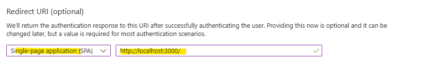

# This is an example project using React and MASL to authenticate.

In this example we will create a React app with TypeScript and authenticate against AAD. The difference in this app is that the user will be authenticated right away and identity established immediately. Most migrated apps require immediate authentication and expect the user has been logged in right away. 

If your application has addressed authentication before a cloud migration, it will migrate much easier and be less expensive/time consuming. 

In this walkthrough we will break it down into two parts, setting up AAD and then creating the app. 
  
# Part One Setting up AAD
In this section we will create the App Registration in AAD. This example uses a redirect to authenticate. What that means is that when the app loads, it will redirect to AAD, do the auth then “redirect” back to your app. The MSAL libraries will pick up the JWT token and confirm login. 
  
## 1) Navigate to AAD

  
## 2) Select "App Registrations"

  
## 3) Click + New Registration

  
## 4) Create a unique name for your app

  
## 5) Select single-page application and set the React app default URL. In this demo it will redirect back to your local host. For production you will have to specify your main DNS.

  
## 6) Copy the ClientID and the TenantID

  
  
# Part Two creating the app
If you do not want to create the app from scratch, you can simply clone (git clone [URL]) this app and set the GUIDs from the last step to the auth.tsx file under auth and run the app (npm start).
  
Below are the steps to creating an app from scratch that uses MSAL and AAD.
  
## 1) Create the shell app with TypeScript
<pre>
    npx create-react-app my-app --template typescript
</pre>
## 2) Install MSAL-react and msal-browser
<pre>
    npm install @azure/msal-react @azure/msal-browser
</pre>
## 3) Create an auth folder under src
This is a good habit to form, create a folder to keep your directories organized.

  
## 4) Copy the authConfig.tsx file
Copy this file from the auth folder. You can create it and copy and past or clone it down. It is the default authCongfig from the MSFT MSAL examples.

  
## 5) Set the values from step 6 part 1
The ClinetID goes in the ClientID field. The Authority is the login url with your TenantID appended:
<pre>
https://login.microsoftonline.com/GUID
</pre>
Example:

  
## 6) Index.tsx Changes
These are the changed needed to the Index.tsx. Once again please reivew the code in this repo.
  
a) Add a reference to msalConfig and MsalProvider
  
b) Add a const for the msalInstance
  
c) Wrap the app with the MsalProvider

## 7) App.tsx Changes
The important thing here is we want to authenticate BEFORE any page loads. And we want the user email as well. This is important on any migration as most app expect the user identity before the app is ready, it just expects the framework to provide it. Many examples of MSAL have authenticated and non-authenticated “zones” where most migrated applications always expect authenticated. Once again this will decrease your time to cloud and minimize you hosting costs, also will give you more options. 
  
a) Add a referece to useMsal, and useMsalAuthentication
  
b) Add a reference to InteractionType
  
c) On line 7 we specify useMsalAuthentication and Redirect. This will force the app to try to authenticate right away.
  
d) Create a hook to set the User. In this example we will capture the email address.
  
e) Create a render function that will keep trying to extract the username from useMsal. In practice this might loop a few times but it will assure you have a valid user before the app is ready. You can also do you API calls at this point (after user has been set). This approach also allows you to call child components as props.
  
f) On line 22 we check to see if m_strUser had been set (will be the email address). If it is, we render the screen with the EMail address (your app is ready render that). If user is empty, we call the Render function and show "Please Wait...". Once again the React engine might refresh a few times but this is required to assure we have a valid user right away. 

# End result!
