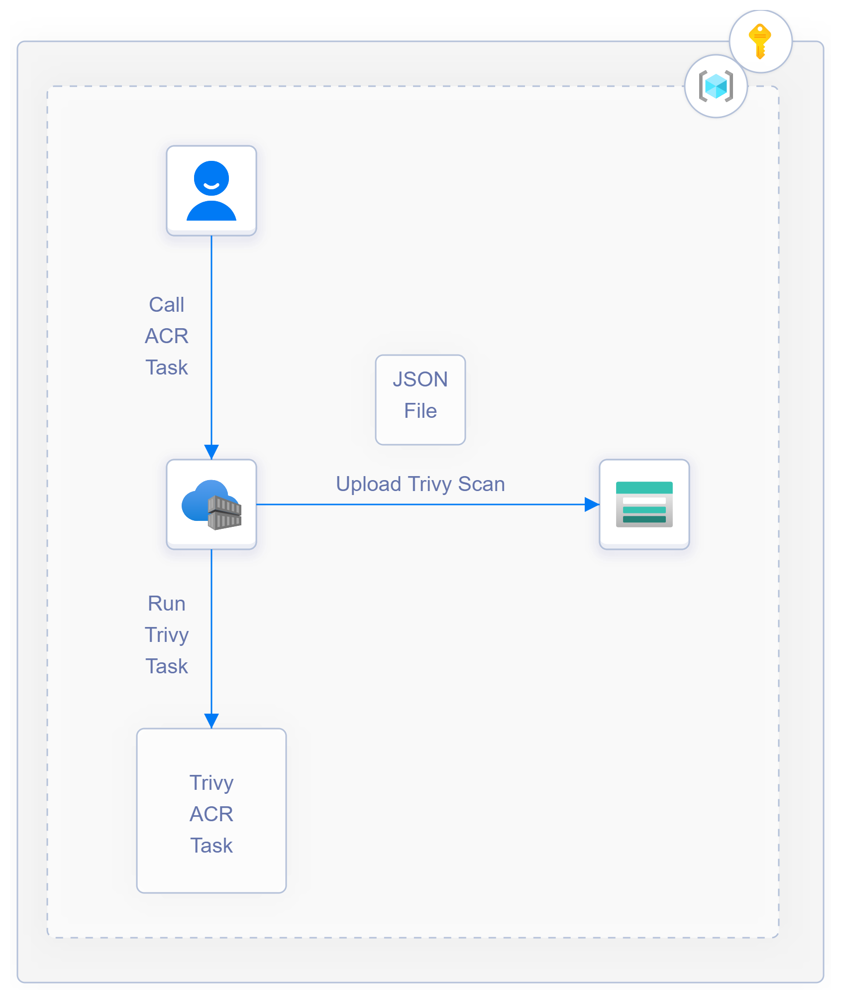

# Run Trivy Scanner with ACR Tasks

## Background

The open-source tool [Aqua Trivy](https://aquasecurity.github.io/trivy/v0.30.3/) is a vulnerability scanner for container images and other artifact types. It's an easy tool to use and can be leveraged for many different types of scans. Review the Trivy documentation to learn more about the different capabilities it supports.

To enable teams to be able to use Trivy as a scanner in addition to the integrated scans that comes with Microsoft Defender for Containers and Azure Container Registry (see [documentation](https://docs.microsoft.com/en-us/azure/defender-for-cloud/defender-for-containers-introduction#vulnerability-assessment) here), this solution uses [ACR Tasks](https://docs.microsoft.com/en-us/azure/container-registry/container-registry-tasks-overview) as a simple way to run the scanner against an image in your registry. Tasks can be scheduled or triggered in many ways to integrate within your proper workflow, whether that's running as part of a CI/CD pipeline, on an automated schedule, or even triggered with tools like Azure Functions and Logic Apps.

## Solution Details

This solution creates an ACR Task that runs the trivy scanner against a defined image, and then will output the results into a storage account. From there, you could have a process monitor the storage account and make downstream decisions based on the results - for example, a logic app could be triggered when a new file is added to the storage account and then send an email if a high severity is detected.



## Pre-Reqs

This solution assumes that you have an image locally that you want to push to your ACR Registry. You can also run an ACR Import to import a test image.

## Helpful Notes

If the Container Registry disables public access, then you will need to "Allow trusted Microsoft services to access this container registry" so that the ACR Task can run with the private ACR. To further allow the task to pull/push images to the registry, a System Assigned Managed Identity must be leveraged.

> Note: Tested with a User-Assigned Managed Identity and did not work, so System Assigned seems to be the requirement currently. Referenced [here](https://docs.microsoft.com/en-us/azure/container-registry/allow-access-trusted-services#example-acr-tasks) where it notes "Enable a system-assigned managed identity when creating the task".

```bash
export RG_NAME=
export LOCATION=
# ACR_NAME must be unique and alphanumeric characters only
export ACR_NAME=
export ACR_IMAGE= # example: nginx:test
export ACR_SKU=Basic 

# CREATE ACR
az acr create \
  --resource-group $RG_NAME \
  --name $ACR_NAME \
  --sku $ACR_SKU

# Import Test Image
az acr import \
  -n $ACR_NAME \
  --resource-group $RG_NAME \
  --source docker.io/library/nginx:latest \ # using docker nginx image as a test - could be any image
  --image $ACR_IMAGE

export ACR_ID=$(az acr show -n $ACR_NAME -g $RG_NAME -o tsv --query id)
export ACR_LOGIN_SERVER=$(az acr show -n $ACR_NAME -g $RG_NAME -o tsv --query loginServer)

### CREATE STORAGE ACCOUNT
# Name must be unique
export STG_ACCT_NAME=
export STG_ACCT_CONTAINER_NAME=

az storage account create \
  --name $STG_ACCT_NAME \
  --resource-group $RG_NAME \
  --location $LOCATION \
  --sku Standard_LRS \
  --kind StorageV2

az storage container create \
  --name $CONTAINER_NAME \
  --account-name $STG_ACCT_NAME

export STG_ACCT_ID=$(az storage account show -n $STG_ACCT_NAME -g $RG_NAME -o tsv --query id)

# Create the Task
export ACR_TASK_NAME=   # example: trivy-scan-test

az acr task create \
    --registry $ACR_NAME \
    --resource-group $RG_NAME \
    --name $ACR_TASK_NAME \
    --context /dev/null \
    -f task.yaml \
    --auth-mode None \
    --assign-identity

# Get System-Assigned MI from Task
export SYSTEM_ASSIGNED_TASK_MI_ID=$(az acr task show -n $ACR_TASK_NAME -g $RG_NAME --registry $ACR_NAME -o tsv --query id)
export SYSTEM_ASSIGNED_TASK_PRINCIPAL_ID=$(az acr task show -n $ACR_TASK_NAME -g $RG_NAME --registry $ACR_NAME -o tsv --query identity.principalId)

# Assign ACR PUll to System-Assigned MI
az role assignment create \
  --assignee $SYSTEM_ASSIGNED_TASK_PRINCIPAL_ID \
  --scope $ACR_ID \
  --role acrpull

# Assign Storage Blob Contributor to System-Assigned MI
az role assignment create \
  --assignee $SYSTEM_ASSIGNED_TASK_PRINCIPAL_ID \
  --scope $STG_ACCT_ID \
  --role "Storage Blob Data Contributor"

# Add System-Assigned MI as Credential to Task
### This is for when your ACR is private and allows trusted microsoft services
az acr task credential add \
  --name $ACR_TASK_NAME \
  --registry $ACR_NAME \
  --resource-group $RG_NAME \
  --login-server $ACR_LOGIN_SERVER \
  --use-identity [system]

# Run Task
az acr task run \
    -n $ACR_TASK_NAME \
    -g $RG_NAME \
    -r $ACR_NAME \
    --set image=$ACR_IMAGE \
    --set stgaccount=$STG_ACCT_NAME \
    --set container=$STG_ACCT_CONTAINER_NAME
```