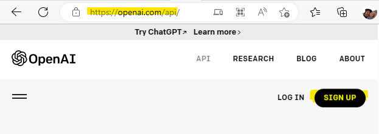
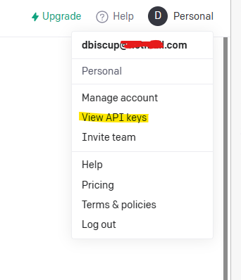
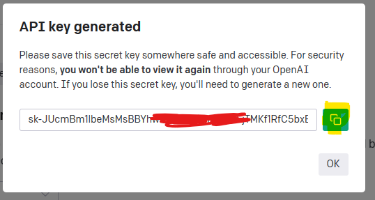

# This is a quick start walkthrough on text generation on OpenAI

In this walkthrough, we will get our API tokens from OpenAI and generate some business ideas with OpenAI/ChatGPT/Davinci and Python.

We will break this down to three parts: Get your API tokens, setting up python then the code. 

  
# Part One API Tokens
First you need to create an account on https://openai.com/. 
  
## 1) Navigate to https://openai.com

  
## 2) After login, click your profile and "View API keys"

  
## 3) Next select "Create new secret key"

  
## 4) Copy your new key

  

  
# Part Two setting up your python environment
Running this PIP install will setup the OpenAI sdk. You will have access to ChatGPT, Dalle etc.
<pre>
pip install --upgrade openai
</pre>

  
# Part Three the code
Below is an example of a python app that will brainstorm bike business plans and write the first result to the console.
<pre>
import openai

openai.api_key = "[keyfromabove]"

response = openai.Completion.create(
  model="text-davinci-003",
  prompt="Brainstorm business plans on bikes",
  temperature=0.8,
  max_tokens=60,
  top_p=1.0,
  frequency_penalty=0.0,
  presence_penalty=0.0
)

print(response['choices'][0]['text'])

</pre>

