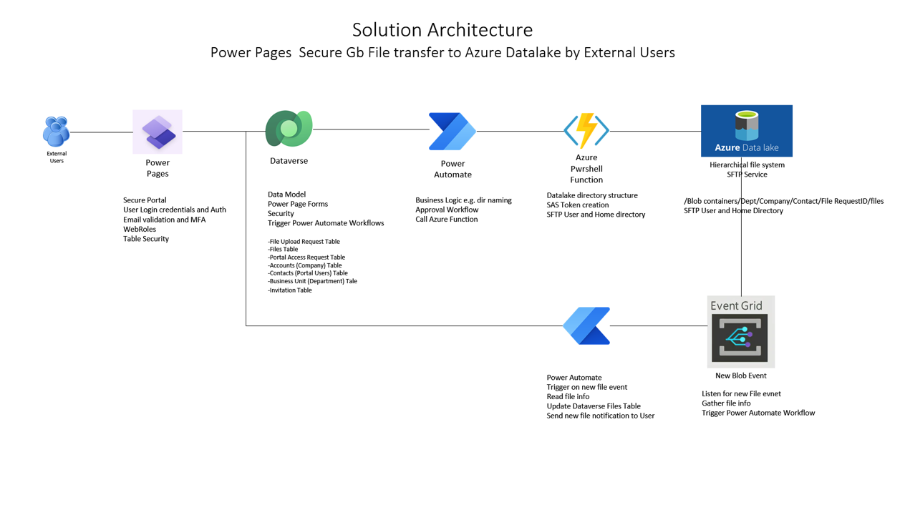
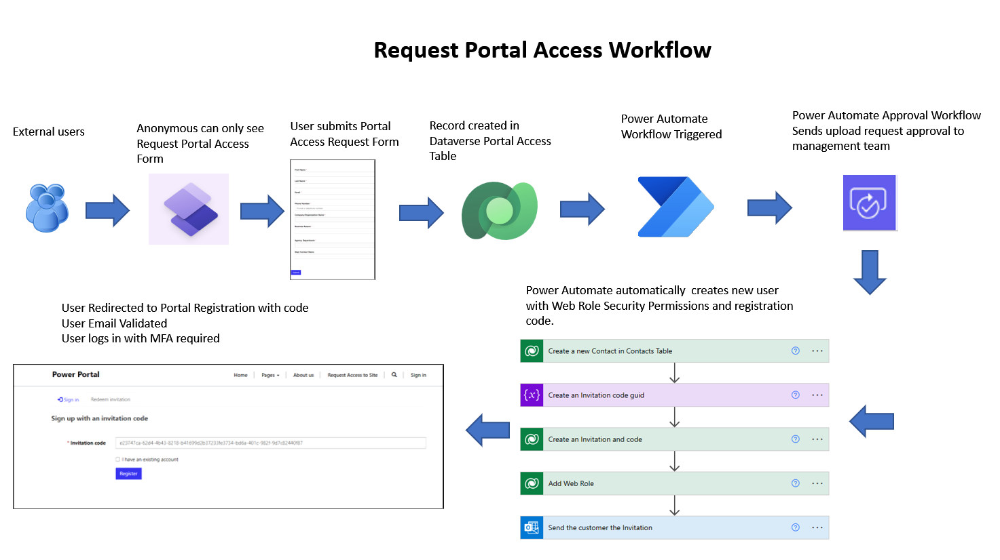
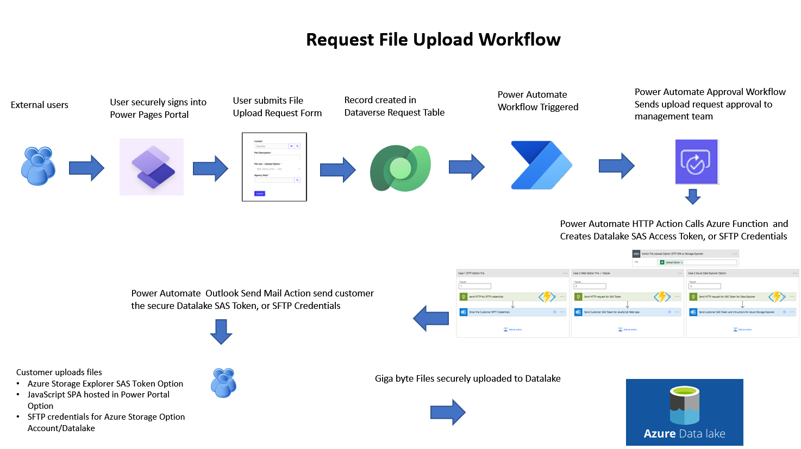
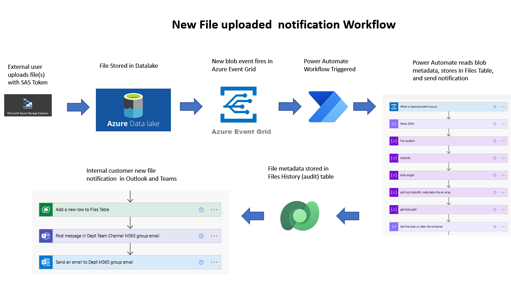

# Power Pages Secure Large Gigabyte File transer to Azure Datalake by External User Identies

## SUMMARY: The Solution provides a way for non AAD external user identies to securely upload large Gigabyte files to an Organizations AAD secured Azure Datalake

## WHAT PROBLEM DOES THE SOLUTION SOLVE?
* Organizations need to receive large files from external customers for Data AI workloads.
* But since the customers are external and don’t have an AAD Identity how do they get credentials to securely transfer files?
* Where  are the files stored and how are they managed?

## SOLUTION: POWER PLATFORM + AZURE
* **Power Pages** provide a portal for external users to register, login, and submit upload request forms
* **Dataverse** provides a relational database to store and audit Datalake uploads and other metadata about users, approvals, upload requests, and file location
* **Power Automate** provide automated workflow and backend services
* **Azure Powershell Functions** provide an automated way to create SAS Tokens and SFTP credentials Azure Blob Storage
* **Azure Datalake** provides  a hierarchical file system and secure petabyte storage at low cost
* **Azure Event Grid** monitors new file upload events and triggers Power Automate file management workflows.

## SOLUTION ARCHITECTURE

## WORKFLOW 1

## WORKFLOW 2 

## WORKFLOW 3

## PRE-REQUISITES

## QUICKSTART

