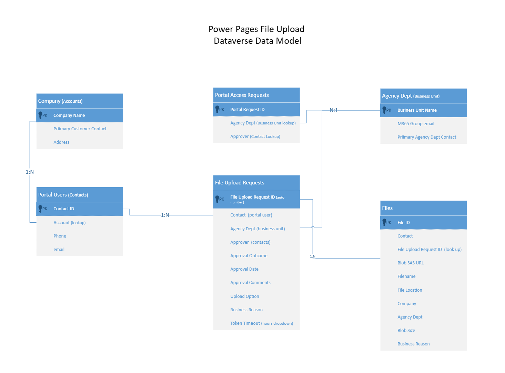

# Power Pages Secure Large Gigabyte File transer to Azure Datalake by External User Identies

## SUMMARY: The Solution provides a way for users external to an organizational AAD tenant boundry to securely upload large Gigabyte files to that Organizations AAD secured Azure Datalake

## What Problem does the solution solve?
* Helps Organizations that maintain an AAD secured Azure infrastrue to receive large files from external customers that dont have an identity in the AAD tenant. For example for Data AI workloads.
* Provides a secure and managed Azure Datalake hierarchicial file system for extremely large scale and file sizes 300Gbytes or more
* Provides an automate the process of creating,managing, and securing external customer identties providing said external customer a mechanism to security upload large files to the organizational datalake. Power Pages provides an Identity managment system that can be federated with external identity providers such as AAD, B2C, and Login.gov
* Provides a Dataverse based records and audit system, logging every portal access request, every file upload, and every approval.

## Solution: Power Platform + Azure 
* **Power Pages** provide a portal for external users to register, login, and submit upload request forms. A
* **Dataverse** provides a relational database to store and audit Datalake uploads and other metadata about users, approvals, upload requests, and file location
* **Power Automate** provide automated workflow and backend services
* **Azure Powershell Functions** provide an automated way to create SAS Tokens and SFTP credentials Azure Blob Storage
* **Azure Datalake** provides  a hierarchical file system and secure petabyte storage at low cost
* **Azure Event Grid** monitors new file upload events and triggers Power Automate file management workflows.

## What the Solution Provides:
* A portal for external users to log on and fill out a form to request permissions to upload a file(s). The system handles up to 300Gbyte files.
* An approval workflow so that new users logins and file upload requests are approved by internal organizational employees
* An option for users to upload files via Java Script web app (hosted in Power Pages),SFTP (hosted in Azure Storage Account SFPT Service), or Azure Storeage Explorer (free and robust large file upload tool by Microsoft)
* A new file notification system that notifies the correct internal employee that a new file has been uploaded
* An audit and reporting system the records in Dataverse every portal access request, user login,file upload request, every file upload and every approval. The Files Table stores the metadata of every file uploaded and its properties, such as location, size, date uploaded, who uploaded, and who approved.
* The ability to federal external user identities with Power Pages Portal.  Such as the external user organizational AAD , Azure AAD B2C, Social Identities, etc.
  
## Deployment
see Deployment Section below

## Solution Architecture

## Solution Components:
1. Datverse Tables:
* **Portal Access Request**  custom  table that stores the portal acess requests. a new row triggers the Portal Access Request Power Automate Workflow
* **File Upload Requests**   custom table that stores the file upload requests. A new row triggers the File Access Request Power Automate workflow
* **Files**  custom table that stores metadata such as file name, size, upload date of blobs in the Data Lake
* **Account** Out-of-the-box standard table storing the Company Name.  
* **Contact** Out-of-the-box standard table storing the Contact Name (Portal User)
* **Business Unit** Out-of-the-box standard table storing the name of the Organizational Departments.  The email is mapped to the M365 Group email of the department.
* **Invitation** Out-of-the-box table storing the portal invitations
* **Web Role** Out-of-the-box table storing the Portal Web Roles.
2. Power Automate Flows:
* **Portal Access Request** is triggered on new row in the Portal Access Request Table.  Takes the external user submitted form data and sends an Approval to the corresponding Dept that the user selected
* **File Upload Request** is triggered on a new row in the File Upload Request Tables. Takes the form subitted and sends an Approval to the corresponding department. If approved, the flow calls the Azure Powershell function which creates the datalake file hierarchy and either SAS Token or SFTP credentials, based on user selection
* **Datalake Blob Events** is trigger on any new blob/file uploaded by way of the previously mentioned credentials. The flow reads the blob metadata , stores in the Files Table, and sends a notification to the corresponding Department.
3. Dataverse Environment
* **Provisioned with Dataverse** standard install
* **Business Units** configured to map to M365 Groups and email.  Power Platform Admin settings
* **Search** Power Platform Admin Settings
* **Email**  Power Platform Admin settings
4. Power Pages Portal
5. M365 Email enabled Security Groups
* one M365 groups for each Department.  Add/remove members to this group
6. Power Apps Solution.  
Solution will be imported into the provisioned environment
1. Azure Datalake
2. Azure Powershell Function
3. SPA  Single Page Application 
* used for smaller file uploads up to 5 Gbyte.  hosted in Power Pages portal
* 
## Workflow 1:   External User Requests Portal Access. Approval Workflow Triggered 
A new user goes to the public portal site for the first time and has not been granted access and  yet given portal credentials. The user is seen as "Anonymous" and can thus only see a limited home page and a form to request access.  The new user submits the  Portal Access Form and an internal automated approval workflow is submitted for review by the internal managment team who receives an email. The approval is routed to a the correct team/department as configured by the combination of M365 Groups + Dataverse Business Unit. The request goes to only the correct team members in the corresponding M365 group. The reviewers are members of the M365 Group. The first one to respond completes the portal acess request approval and then workflow automatically creates a private registration code and emails the new user.  Permissions, web roles,email validation, and multi-factor authentication is automatically configures for the user. The user is sent an email and is redirected to the registraion site to one time create their registration and complete the credential grant process. The external user is now able to login to the portal.

## Workflow 2: External User Requests permission and credentials to upload a file.  Triggers Approval worflow and automatic datalake credential creation
The external user is logged on to the portal with the previoulsy granted login credentials. They now request permission to upload a file.  The user submits a file upload request form which starts a similar approval process where by the approval request is sent to the corresponding internal department as configured by M365 Groups + Dataverse Business Units.  The first M365 Groups membrer to repond approves the request and then the Power Automate workflow calls a backend Azure Powershell Function that automaticall creates the corresponding Datalake file hierarchy and either a  SAS Token or SFTP credentials based on the user seleced option.  The credentials are emailed to the external user who procedes to upload the file(s).

## Workflow 3:   New File Uploaded Notification to Department. New File metadata stored in the Files table
Event Grid monitors for new blob events. When a new blob is uploaded the event is triggered and the New File Power Automate flow fires. The flow reads and parses the new blob meta data, updates the corresponding Files Table record, and send an email and/or Teams notification to the Approving Department M365 Groups team.

## Data Model

## Pre-Requisites
1. Power Apps Environment with Dataverse.
   1. Power Apps System Adamin role
2. Azure Subscription
   1. GA Global Administrator
   
3. For Automated Deployment and Test (Optional)
   1. PowerShell 7.2 https://learn.microsoft.com/en-us/powershell/scripting/install/installing-powershell?view=powershell-7.3
   2. Azure CLI  https://learn.microsoft.com/en-us/cli/azure/install-azure-cli
   3. Power Platform CLI https://learn.microsoft.com/en-us/power-platform/developer/cli/introduction
   4. Visual Studio Code  https://code.visualstudio.com/
      1. PowerShell Extension for Visual Studio Code https://marketplace.visualstudio.com/items?itemName=ms-vscode.PowerShell
      2. Azure Account Extension for Visual Studio Code https://marketplace.visualstudio.com/items?itemName=ms-vscode.azure-account
      3. Azure Functions Extension for Visual Studio Code https://marketplace.visualstudio.com/items?itemName=ms-azuretools.vscode-azurefunctions
      4. Azure Storage Extension for Visual Studio Code https://marketplace.visualstudio.com/items?itemName=ms-azuretools.vscode-azurestorage
      
   
## Deployment

### AZURE
#### _Storage Account v2 with Datalake,  Static Web App , SFTP Service ,  Function App_
 1. **Azure Portal**
    1. **Create a Resource Group**
       1. Open Azure Portal.  Select Resource Groups
       2. Select Create.  Choose your Resource Group Name and Region
    2. **Create Azure Storage Account v2 with Datalake, SFTP Service, Static Web App**
       1.  In the Azure Portal select Create a resource. choose Storage Account, Create
       2.  Choose your newly created Resource Group, name, Region, Performance: Standard, Redundancy:GRS
       3.  In Advanced Tab keep the defaults and also select:
           1.  Enaable hierarchical namespace
           2.  Enable SFTP
       4.  keep the remaining defaults and select create
       5.  once the storage account is created enable static website.  use $index and $error for document paths.copy the primary endpoint for later use
       6.  Configure CORS Rules
           * AllowedOrigins=@("*"); 
           * ExposedHeaders=@("x-ms-meta-*"); 
           * AllowedHeaders=@("Authorization","x-ms-meta-ab","x-ms-meta-target*","x-ms-meta-data*");
           * MaxAgeInSeconds=0;
           * AllowedMethods=@("PUT","GET","DELETE","HEAD","POST")

    3.  **Create Azure Function App** 
        1.  Create an App Service Plan
            1.  Select Create a Resource / App Service Plan
                1.  your subscription
                2.  Resource Group previously created
                3.  App Service Plan Name
                4.  Operating System: Windows
                5.  Region (closes to your locaion)
                6.  Pricing plan:   pick one that suites your cost/performace needes such as Standard S1 (you can scale up/down later)        
        2.  Create Application Insights and Log Analytics workspace for function monitoring
            1.  Select Create A Resource / Log Analytics Workspace
                1.  select your resource group  that you previoulsy created
                2.  Name
                3.  Region  = same as Resource group and app service plan region
            2.  Select Create A Resource / Application Insights
                1. select your resource group
                2. name
                3. region = the same region as your resource group and app service plan
                4. Log Analytics Workspace = the one you just created               
        3.  Create a Function App
            1.  Select Create a Resource / Function App
            2.  Resource Group = resource group you previously created
            3.  Name
            4.  Code
            5.  Run Time Stack  = Powershell Core
            6.  Version 7.2
            7.  Region = the region you selected for your Previouly created App Service Plan
            8.  Operating System Windows
            9.  Plat Type = App Service Plan
            10. Windows Plan = the previously created App Service plan you created
            11. Hosting = Create new Storage Account
            12. Networking Enable Public Access
            13. Monitoring  = Select the App Insights resource you created in the previous steps
        
        4.  Create system assigned managed identity
            1.  Go to Identity and add System Assigned Managed Identity
            2.  and add role assignment  to the storage account just created. scope=storage resource/your datalake storage account previously created /Role = contributer

        5. Deploy Function App
           1. From the Cloud Shell upload the Zip Function all
           2. az functionapp deployment source config-zip -g greg-powerportal-largefile -n PowerPortalFileManagement --src  PowerPortalFileManagement2.zip

        6. Configure App Configurations Settings
           1. az functionapp config appsettings set --name MyFunctionApp --resource-group MyResourceGroup --settings "AzureWebJobsStorage=$storageConnectionString"
                * ResourceGroup: xxresoursegroupname
                * StorageAccountName: xxdatalake4powerpages
                * Subscription: 0035cc8c-1269-4fb4-8f16-xxxxxxxxxxx
                * Tenant: ba1e9f6b-2cec-4c10-8616-xxxxxxxxxxx
                * Cloud: AzureUSGovernment or AzureCloud
                * connectionstring:  "xxxxxxxxget from storage account access keys"
                * ftp_endpoint: "the base of the ftp endpoint e.g. datalake4powerpages.blob.core.usgovcloudapi.net  get from SFTP User setting"
            2. Copy the Funtion URL. This will be used on the Env Variable when you import the solution. you can find the URL in the azure portal Overview main page for the deployed function app
         
         
    4.  **Create Event Grid and Subscription** for new blob events in the newly created Storage Account for Datalake       
        1.  Creat Event Grid
        2.  Create Subscription
        
    5.  **Configure Static SPA**
     
 2. **Create Automated Script TODO tbd**
    1. install az cli
    2. login and set context
       1. as set cloud
       2. az login
       3. az set subcription   3. 
    3. Create Resource Group
    4. Create Storage account
    5. Create Function App
    6. Deploy Funtion App
    7.  Deploy Function App Settings
    8.  Create Event Grid
    9.  Create Event Grid Subscription  

### POWER PLATFORM
####  _Dataverse Environment, Power Pages,Import Solution, Security,  Principals, Connections, Tables, Workflows, Email, Search_
 1. **Create a New Dataverse Environment**
    1. Open Power Platform admin center with System Administrator role.Select Environments/ New to  Create Dataverse Environment with Dataverse. 
    2. Choose Sandbox. Select the Create a database for this environment switch. 
    3. No need to enable Dynamics 365 or sample apps. 
    4. Select Save to provision the new environment     
 2.  **Configure Dataverse Environment**
     1.  Configure Business Units for Datavese in power platform admin settings
     2.  Configure email for Dataverse in power platform admin setting
     3.  Configure Search in power platform admin settings           
 3.  **Create a Power Platform Admin Service Principal**
     1.  In the AAD Admin Council Create an AAD user  called for exmple Power Platform Admin . this will be used by the connections and flow email from the flow. Assign power platform and power automate licence.
     2.  Assign Power Platform Administer role in AAD and System Admin role in Dataverse
     3.  Disable MFA for this principal       
1. **Create M365 Groups emailed enabled security groups for Organication Departments**
   1. Go in AAD Admin.  Create an new M365 group. select and copy the email address of the group.  Add users to the respective group.
   2. Copy the M365 group email, it will be used later when you configure Dataverse Business Units  
2. **Create Connections in the new environment.** These will be used when the solution is imported.  Use the previouly created service principal
   * Microsoft Teams
   * Approvals
   * Microsoft Dataverse
   * Office 365 OUtlook
   * Office 365 Groups
   * Azure Event Grid
3. **Create Portal**
   1. From Power Apps Studio Select New App/website
   2. Pick a name.  Do **not** chose the "Use data from existing website record".  
   3. Select Create The portal could take 30 or more minutes to provision.        
4. **Import Portal Config**      
5. **Import Solution**
   1.  Download the solution.zip file to your local hard drive.
   2.  In the Power Apps Studio select your newly created environment
   3.  Select Soluions/Import Solution to import the downloaded solution
       1.  When promted enter the connecttion info from your environenment previously created 
6.  Publish the Solution
7.  Test the Solution       

   

