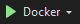
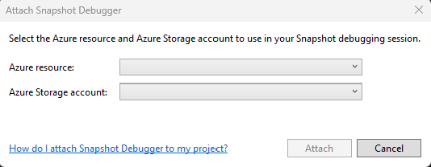
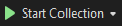
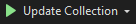
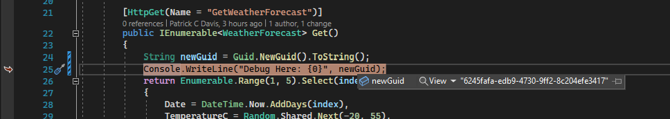

# Remote Debugging with an ASP.NET Core API on a Container in Docker and AKS
This example demonstrates how to debug a ASP.NET Core API deployed to a container on AKS and Docker. This tutorial is intended to demonstrate a useful developer tool utilizing AKS and enable developers to do more and remove roadblocks with existing tools. 

## Terms
* AKS - [Azure Kubernetes Service](https://docs.microsoft.com/en-us/azure/aks/intro-kubernetes)
* ACR - [Azure Container Registry](https://azure.microsoft.com/en-us/services/container-registry)
* VS - Visual Studio *Enterprise* - Visual Studio Enterprise 2022 was used for creating this guide.

## Prerequisites  

* Powershell 7.2.5 or latest stable
* Azure Command Line (az)
* Bicep Command Line (bicep)
* An Azure subscription with contributor rights for a resource group and permissions to create a new resource group during the AKS creation.
* Docker Desktop
* Local Kubectl 
* Visual Studio *Enterprise* 2019 or later with the "ASP.NET and web development" and "Azure Development" Extensions installed. 
    > ***The Enterprise level license is required.***

### Upgrade all local tools
* Upgrade the bicep version (Tested with 0.4.1272)
    `az bicep upgrade`
* Upgrade Azure CLI (Tested with 2.38.0)
    `az upgrade`
* Upgrade Visual Studio
    1. Go to the "Help" menu
    1. Select "Check for Updates".
* Open Docker Desktop and verify that you have the latest version (Tested with 4.9.0)
* Upgrade kubectl (Tested with 1.24.0)

### Components
* ./infrastructure/ - The bicep code for AKS and Azure Container Registry
* ./Source/DebugAPI/ - The Visual Studio Project
* ./Source/DeployThis/ - The folder with default deployment for debugging

## Connectivity and Modules
Remote Debugging requires connectivity over ports <b>for VS 2022 4026 and for VS 2019 4024</b> to the container from the instance of Visual Studio connecting to it. These ports are opened internally by snapshot module and the output is compiled to the storage account. Visual Studio needs to download the files from the storage account. If necessary Azure has pre-configured VM images with Visual Studio installed and can be used from within the network to remote debug your application. 

To create snapshots, the container module must be included in the docker file to send snapshots to the appropriate storage account. In this example this module is included for you in the Dockerfile on lines ~4 - ~33 and is configured for .NET 6. Other [snapshot tools for different .NET versions are located at this link](https://github.com/Microsoft/vssnapshotdebugger-docker). The correct module must be added to for the correct .NET version. The storage account for the snapshot must be contained within the same location as the AKS Cluster. You must also have permissions to create and manage containers on that storage account. This can be created via Visual Studio or the include bicep file. 

This example uses an open ASP.NET Core API container. There are no network protections in this example. In this example the dockerfile and deployment specification exposes all the necessary debug ports and includes the necessary modules.

## Setup 
An Azure Kubernetes Cluster Service (AKS), an Azure Container Registry (ACR) and Azure Storage account are created in this tutorial. To reduce cost the AKS instance can be stopped/deleted when not in use to reduce cost.

1. Create a resource group for deployment. This name will be reused in the next several steps.
1. Download this registry.
1. Open a Powershell command line to this repo folder.
1. On the command line login to Azure
        `az login`
1. Set the subscription, this step is needed if you have multiple subscriptions associated with your account
        `az account set --subscription [Subscription ID]`
1. Run the bicep command to create the necessary resources. Note the default D1 App Service plan will incur some cost. 
    `az deployment group create -g [ResourceGroup] --template-file '.\infrastructure\template.bicep' --parameters '.\infrastructure\parameters.json'`
1. [1]Build and Deploy to Local Docker. Similar steps can be performed using the docker desktop UI. Run docker locally during these steps.
    1. Create the docker image 
        
        ```[ps]
        docker build -f .\Source\DebugWebAPI\DebugWebAPI\Dockerfile -t debugwebapilocal .\Source\DebugWebAPI\
        ```
    1. In Docker Desktop, run the image or on the command line (this will start docker on standard ports)
        ```[ps]
        docker run --name debugwebapiimage -d -p 80:80 -p 443:443 -p 4026:4026 -p 4024:4024 -p 4022:4022 debugwebapilocal
        ```
    1. Verify the local image is running on http://localhost/swagger
1. Push build to Azure Container Registry
    1. Login to Azure CLI
        ```[ps]
        az login
        ```
    1. Login to your container registry 
        ```[ps]
        az acr login --name [Azure Container Registry Name]
        ```
    1. Create the local docker image (if necessary)
        ```[ps]
        docker build -f .\Source\DebugWebAPI\DebugWebAPI\Dockerfile -t debugwebapilocal .\Source\DebugWebAPI\
        ```
    1. Tag the local image with the container
        ```[ps]
        docker tag debugwebapilocal [Azure Container Registry Name].azurecr.io/debugwebapiaks
        ```
    1. Push the image to the Azure Container Registry.
        ```[ps]
        docker push [Azure Container Registry Name].azurecr.io/debugwebapiaks
        ```
        > __Note:__
        > Once a container is pushed to the Azure Container Registry you could pull and run the container from the Azure container registry rather than pulling and pushing from your local client.
1. Deploy as a Pod to AKS and check access
    > No Namespaces are used in this creation. All pods are created in the default namespace
    1. Connect to your AKS cluster
        1. Go to the Azure Portal
        1. Browse to your AKS Cluster
        1. Click Connect. **Note** the first two commands
        1. In a local PowerShell Login to Azure CLI
            ```[ps]
            az login
            ```
        1. In the local PowerShell Set the subscription. The first command from the connect sidebar in the portal.
            ```[ps]
            az account set --subscription [Subscription ID]
            ```
        1. Connect to the AKS Cluster. The second command from the connect sidebar in the portal.
            ```[ps]
            az aks get-credentials --resource-group [Resource Group Name] --name [AKS Cluster Name]
            ```
        1. Update the `deployment.yaml` with the name of the Azure Container Registry. This will be on line ~17
        1. Create the deployment on the cluster
            ```[ps]
            kubectl apply -f ".\Source\DeployThis\deployment.yaml"
            ```
        1. Get the External IP address of the service. **Note** the EXTERNAL-IP Address
            ```[ps]
            kubectl get service
            ```
        1. Test to make sure the system is working by browsing to the site http://[EXTERNAL-IP]/swagger
        
## Remote Debugging
Remote debugging requires the debugging symbols to be deployed to the remote target. Sometimes these are removed to reduce package sizes. These need to be added back in to enable debugging.

> <b>Notes:</b> 
> 
> * Configuration for CI/CD will need to be changed in the build pipeline of your chosen CI/CD tool (Azure DevOps, GitHub, etc.).
>
> * The deployment and configuration settings included with this project. 
> * The same Code must be deployed to the AKS cluster as what is running on the local. Any changes will prevent Snapshot from mounting until the newer code is deployed. 

### Debugging from a local Docker Desktop run
1. Enable docker on the project
1. Ensure that the docker file can be executed from the solution directory
1. Debug the program though the docker debug button
    
1. The debugger will run as if it is hosted through IIS express with the ability to step through code

### Debugging from the AKS cluster
Note the ports in the deployment file are open and available. 
1. With AKS and the Pod properly Running, Go to Visual Studio Enterprise and choose Debug -> "Attach Snapshot Debugger" 
    
    1. Choose the following options
        1. In the Azure resource choose the AKS Cluster, 
        1. In the Azure Storage account choose the storage account created with the bicep file earlier. 
    1. Click Attach to enter Snapshot Debugging mode
    1. Wait for all the modules to load (about 45 seconds). The Module window is found under Debug -> Windows -> Modules. The Start Collection button will not enable until these are loaded.
1. Set a Snapshot Point
    1. Open the Code and Set a Snapshot Point like you would a breakpoint, Suggested line ~25 to inspect the GUID printed to the console 
    1. Click Start Collection 
        > *Note*: The Start Collection button will be grayed out until all modules are loaded
        > 

        > Adding or Removing a snapshot will require you to "Update Collection" using the same button
        >
    1. Call the Web API through the Swagger page viewed on the AKS Cluster in the setup. 
    1. Click/View on the Snapshot that was created
        
    1. View the runtime values of the local variable
        

## Clean Up

### Azure Resources
Delete the resource group and all contained components

### Remove local docker image
Stop the local image, then remove the image and the container

```[ps]
docker stop debugwebapiimage
docker rm debugwebapiimage 
docker rmi debugwebapilocal 
```

## References
* [dockerfiles for the profilier](https://github.com/Microsoft/vssnapshotdebugger-docker)
* [Snapshot Debugger walkthrough](https://github.com/MicrosoftDocs/visualstudio-docs/blob/10bae0fd2b2a58893d28aa1380141046704696ed/docs/debugger/debug-live-azure-kubernetes.md)
* [Snapshot Debugger](https://aka.ms/snappoint)
* [Snapshot Required Ports](https://docs.microsoft.com/en-us/visualstudio/debugger/remote-debugger-port-assignments)