# Serverless Cloud Native Workshop - Backend Setup
**Create the backend Api and setup Cosmos DB**
**Last Update**: 4/25/2022


# What we are building
We will be building a simple API that can support the bicycle shop SPA.


# Setup needed tooling

|  |  |
| ----------- | ----------- |
| Install NPM | https://nodejs.org/en/download/ |
| Install .net core | Windows: https://dotnet.microsoft.com/download/dotnet-core/thank-you/sdk-3.1.402-windows-x64-installer <br/> Mac: https://dotnet.microsoft.com/download/dotnet-core/thank-you/sdk-3.1.403-macos-x64-installer |
| Install Postman | https://www.postman.com/ |
| Install VS Code  | https://code.visualstudio.com/Download <br/> Default settings on OK. |
| Install Azure Funtions core tools | https://go.microsoft.com/fwlink/?linkid=2135274 <br> Mac: brew tap azure/functions <br> brew install azure-functions-core-tools@3|
| Install Azure Funtions Extension |  |
| Install C# Extension |  |
| Close VS Code |  |
|  |  |
| Test Policy (optional) | https://www.postman.com/ |
| Test Policy from Powershell | Get-ExecutionPolicy -List |
| Set Poloicy from Powershell | Set-ExecutionPolicy Unrestricted -Scope CurrentUser -Force |

# Build Data Store
|  |  |
| ----------- | ----------- |
| Login to Azure Portal|  |
| Search for Cosmos|    |
| Select Resource Group|    |
| Create Account Name|    |
| Choose SQL Core|  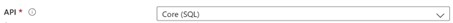  |
| Select Capacity Mode|    |
| Limit Throughput|    |
| Let it cook for 10 minutes |  |
| Get your connenction string | 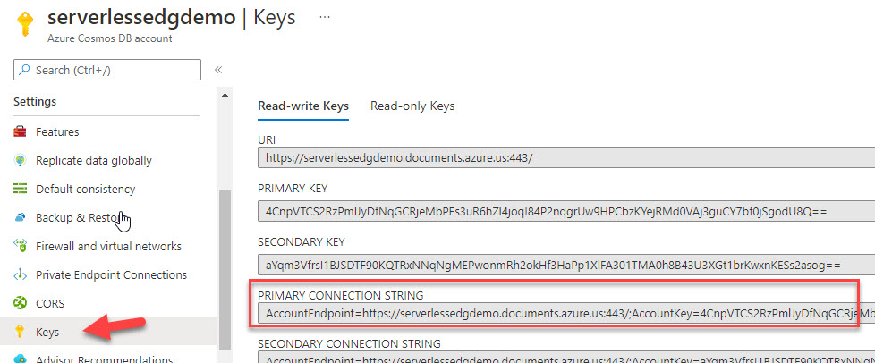 |

# Create Project in VS Code
|  |  |
| ----------- | ----------- |
| Open cmd prompt |   |
| Goto Root | cd \  |
| Make Folders | md Projects <br/> cd Projects <br/> md Backedn <br/> cd backend |
| Open VS Code | code.  |
| Open command pallet |     |
| From commaned pallet create new project |     |
| Select your folder |     |
| Select language (C#)  |  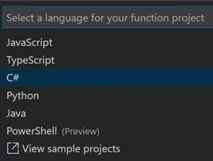   |
| Select .net version (.Net Core 3)  |  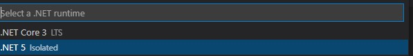   |
| Select 'HttpTrigger' as template |  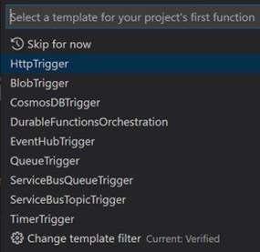   |
| Enter 'Bike' as function name |     |
| Leave namesapce as it |  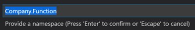   |
| Leave Access rights as 'Function' |   |
| Update CQRS settings |  |
| Add this to local.settings.json | , <br> "Host": { "CORS": "*"}  |
|  |   |
| Run the program |  F5  |
| Get URL to Bike API |    |
| Open Postman |   |
| Open cmd prompt |    |
| Open cmd prompt |    |


# Create your container
|  |  |
| ----------- | ----------- |
| In the Azure portal go to your cosmos instance |   |
| Navigate to Data Explorer | 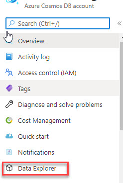  |
| Make Folders | md Projects <br/> cd Projects <br/> md Backedn <br/> cd backend |
| Open VS Code | code.  |
| Open command pallet |     |

# Update code to use Cosmos
|  |  |
| ----------- | ----------- |
| Open VS Code |   |
| Open project file | 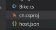  |
| Add Cosmos package to the itemgroup | <PackageReference Include="Microsoft.Azure.Cosmos" Version="3.14.0" //> |
| Create a new file named DAL.cs |   |
| Add add the below code |   |
``` 
using System;
using Microsoft.Azure.Cosmos; 
using System.Threading.Tasks;
using System.Collections.Generic;

public class DAL {

 public const string COSMOS_CONTAINER = "bike";
 public const string COSMOS_BIKE_TABLE = "bike";
 private const string COSMOS_CONNECTION_STRING = "YOURS";


private static Lazy<CosmosClient> m_lcdb = new Lazy<CosmosClient>(InitializeCosmosClient);
    private static CosmosClient m_cdb => m_lcdb.Value;
    private static CosmosClient InitializeCosmosClient()
    {
        return new CosmosClient(DAL.COSMOS_CONNECTION_STRING);
    }

public static async Task CreateBikeAsync(Models.Bike Bike)
    {
        try
        {
            Container c = m_cdb.GetContainer(DAL.COSMOS_CONTAINER, DAL.COSMOS_BIKE_TABLE);
            await c.CreateItemAsync<Models.Bike>(Bike);
        }
        catch (Exception ex)
        {
        }
    }

}
```
# Create a Model class
|  |  |
| ----------- | ----------- |
| Create a folder called "Models" |   |
| Create a file 'Bike.cs' in the new folder |   |
| Add add the below code |   |
``` 
using Newtonsoft.Json;
namespace Models
{    public  class Bike
    {
        [JsonProperty(PropertyName = "id")]
        public string ID { get; set; }
        public string Model {get;set;}
        public string Make {get;set;}
        public double Price {get;set;}
        public int Quantity {get;set;}
    }
}
```
# Test creating a bike
|  |  |
| ----------- | ----------- |
| Open Bike.cs in the root folder |   |
| Add add the below code. Toward the top of the code, right below the 'log.LogInformation' code |   |
``` 
Models.Bike b = new Models.Bike();
b.ID = Guid.NewGuid().ToString();
b.Make = "Specialized";
b.Model = "FSR";
b.Price = 10000;
b.Quantity =10;
await DAL.CreateBikeAsync(b);
```
|  |  |
| ----------- | ----------- |
| Open Postman |   |
| Run the project and then call from postman |   |
| Navigate to Data Explorer |   |
| Expand your container | 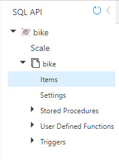  |
| You should see an item | 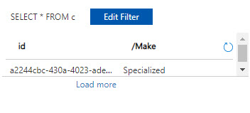  |


# Complete update DAL.cs
|  |  |
| ----------- | ----------- |
| Add the methods to DAL.cs|   |
```
public static async Task<Models.Bike> 
GetBikeByIDAsync(string ID, string Partition)
    {
        Models.Bike bkReturn = null;
        
        try
        {
            Container c = 
m_cdb.GetContainer(DAL.COSMOS_CONTAINER, DAL.COSMOS_BIKE_TABLE);
    
            bkReturn = 
await c.ReadItemAsync<Models.Bike>(ID, new PartitionKey(Partition));
        }
        catch (Exception ex)
        {

        }

        return bkReturn;
    }

public static async Task<Models.Bike[]> GetAllBikesAsync()
{
    List<Models.Bike> abk = new List<Models.Bike>();
    try
    {
        Container c = m_cdb.GetContainer(DAL.COSMOS_CONTAINER, DAL.COSMOS_BIKE_TABLE);

        var sqlQueryText = "SELECT * FROM c";

        QueryDefinition queryDefinition = new QueryDefinition(sqlQueryText);
        FeedIterator<Models.Bike> queryResultSetIterator = c.GetItemQueryIterator<Models.Bike>(queryDefinition);

        while (queryResultSetIterator.HasMoreResults)
        {
            FeedResponse<Models.Bike> currentResultSet  = await queryResultSetIterator.ReadNextAsync();
            foreach (Models.Bike b in currentResultSet)
                abk.Add(b);
        }
    }
    catch (Exception ex)
    {

    }

    return abk.ToArray();
}

public static async Task SaveBikeAsync(Models.Bike Bike)
{
    try
    {
        Container c = m_cdb.GetContainer(DAL.COSMOS_CONTAINER, DAL.COSMOS_BIKE_TABLE);
        await c.ReplaceItemAsync<Models.Bike>(Bike, Bike.ID);
    }
    catch (Exception exError)
    { }
}
```

# Update Bike.cs
|  |  |
| ----------- | ----------- |
| Replace all code after the login information |   |
```
switch (req.Method.ToString())
{
    case "GET":
        {
            Models.Bike bk = new Models.Bike();
            try
            {
                string strID = req.Query["ID"];
                string strPartition                                = req.Query["Partition"];
                bk = await DAL.GetBikeByIDAsync(strID, strPartition);
            }
            catch (Exception exError)
            {
                return new StatusCodeResult(500);
            }

            return new JsonResult(bk);
        }
    case "POST":
        {
            try
            {
                string strBody = await new StreamReader(req.Body).ReadToEndAsync();
                Models.Bike bk = JsonConvert.DeserializeObject<Models.Bike>(strBody);

                if (bk.ID == null || bk.ID == string.Empty)
                {
                    bk.ID = Guid.NewGuid().ToString();
                    await DAL.CreateBikeAsync(bk);
                }                                
                else
                    await DAL.SaveBikeAsync(bk);
            }
            catch (Exception exError)
            {
                return new StatusCodeResult(500);
            }

            break;
        }
}

return new OkResult();

```

# Create Bikes HTTP function
|  |  |
| ----------- | ----------- |
| Open command pallet |     |
| From commaned pallet create new function |  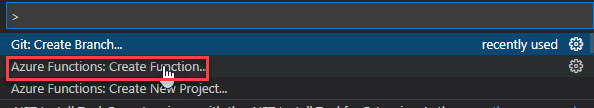   |
| Name the function Bikes |     |
| Implement the function by replacing the code |   |
```
Models.Bike[] abk;
try
{
    abk = await DAL.GetAllBikesAsync();
}
catch (Exception exError)
{
    return new StatusCodeResult(500);
}

return new JsonResult(abk);

```

# Test the function
|  |  |
| ----------- | ----------- |
| Open postman |     |
| Retrieve the ID for the item created |  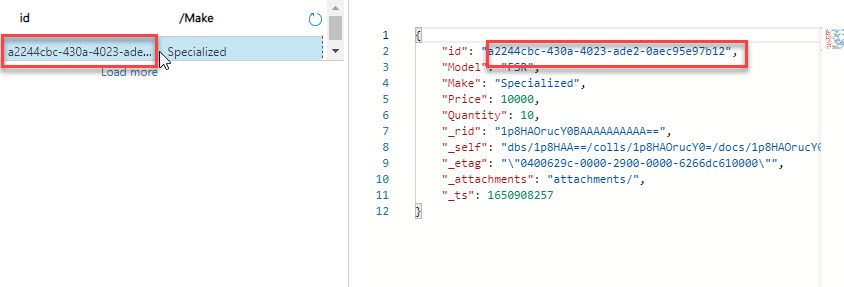   |
| Test Get Bike |  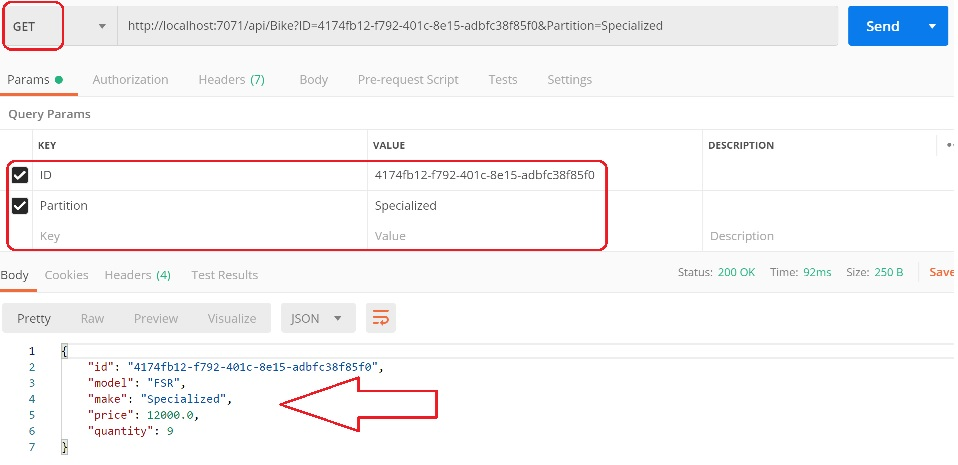   |
| Test Post Bike with ID (update) |  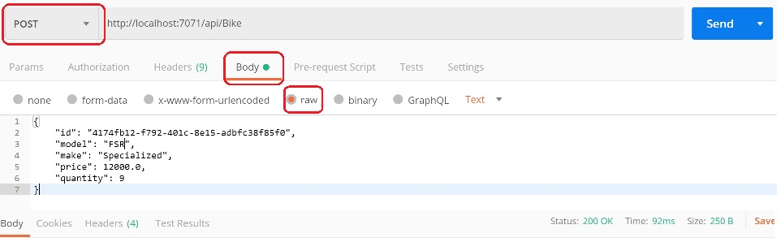   |
| Test Post Bike with no ID (create) |  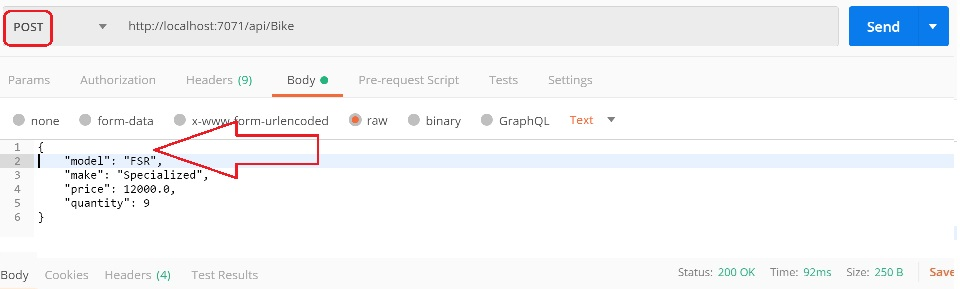   |
| Test Get Bikes |  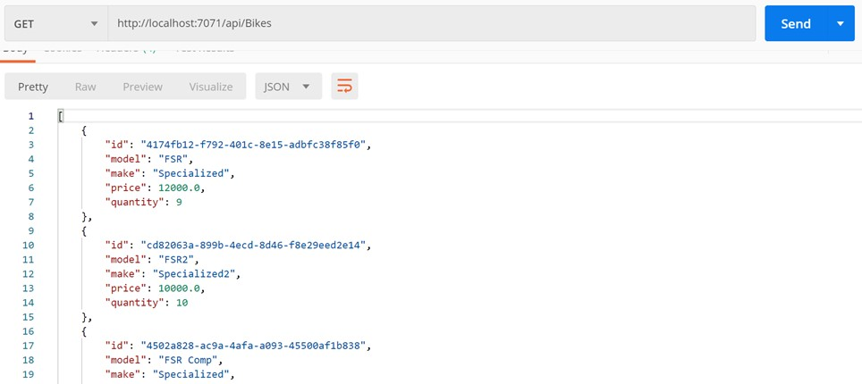   |

# Deploy to Azure (Optional)
|  |  |
| ----------- | ----------- |
| In VS Code open command palette |     |
| Select Azure sign in Cloud |  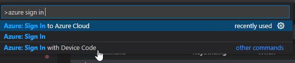   |
| Choose your cloud |  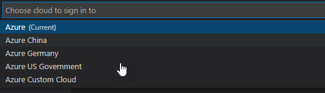   |
| Press enter (default) for the tenant |    |
| Finished sign-in via the browser |    |
| Open command palette |     |
| Choose create in Azure |  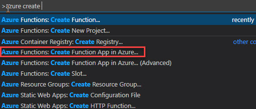   |
| Choose you subscription, enter unique name and select region |  |
| Wait for app to create |  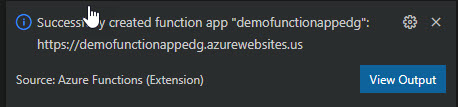   |
| Goto the Azure Portal |     |
| Naviagate to the function and copy the urls |  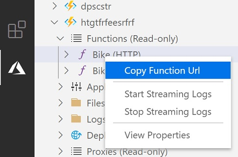   |
| You can now run the tests from the “Test Service” section with those URLS. Please note the ?code=XXX. You need to make sure you include that token. |  |

